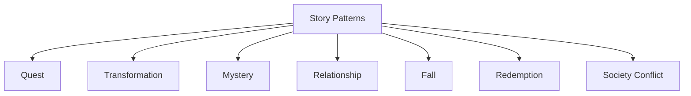

# Master Table — Story Pattern Dataset

このノートは名作の物語構造を蓄積するデータベースである。

目的

- 構造比較
- パターン発見
- 創作参考

---

# テーブル

| 作品 | 媒体 | 主パターン | 副パターン | Dramatic Question | 主題 |
|-----|-----|-----|-----|-----|-----|
| 君の名は | 映画 | Relationship | Mystery | 二人は出会えるのか | 人は記憶を越えて繋がれる |
| 千と千尋の神隠し | 映画 | Transformation | Quest | 千尋は元の世界へ戻れるか | 成長と自己発見 |
| リコリス・リコイル | アニメ | Relationship | Redemption | 二人の関係は守られるか | 生き方の選択 |
| 進撃の巨人 | アニメ | Society Conflict | Mystery | 人類は自由を得られるか | 自由と犠牲 |
| デスノート | アニメ | Fall | Mystery | 夜神月は世界を支配できるか | 正義と権力 |
| ハリーポッター | 小説 | Quest | Transformation | ハリーはヴォルデモートを倒せるか | 愛と勇気 |
| ロード・オブ・ザ・リング | 小説 | Quest | Society | 指輪は破壊されるか | 権力の誘惑 |
| スターウォーズ | 映画 | Quest | Transformation | 反乱軍は帝国に勝てるか | 希望と成長 |
| 君の膵臓をたべたい | 小説 | Relationship | Transformation | 二人の時間は続くのか | 生の価値 |
| 鬼滅の刃 | 漫画 | Quest | Redemption | 妹を人間に戻せるか | 家族愛 |
| 新世紀エヴァンゲリオン | アニメ | Psychological | Society | シンジは自分を受け入れられるか | 自己受容 |
| ワンピース | 漫画 | Quest | Friendship | ルフィは海賊王になれるか | 夢と仲間 |
| ナウシカ | 映画 | Society | Redemption | 世界は救われるか | 共生 |
| タイタニック | 映画 | Relationship | Tragedy | 二人は生き延びられるか | 愛と運命 |
| ダークナイト | 映画 | Moral | Society | バットマンは街を守れるか | 正義の代償 |
| グリーンマイル | 映画 | Redemption | Moral | 奇跡は救いをもたらすか | 人間の善 |
| パラサイト | 映画 | Society | Fall | 家族は成功できるか | 格差社会 |
| ショーシャンクの空に | 映画 | Redemption | Transformation | アンディは自由を得るか | 希望 |
| マトリックス | 映画 | Mystery | Quest | ネオは救世主なのか | 現実と自由 |
| アベンジャーズ | 映画 | Quest | Society | 世界は守られるか | 協力 |

---

# パターン分類

---

# 使い方

1  
作品を見たら Case ノートを作る

2  
ここに

- 主パターン
- Dramatic Question
- テーマ

を追加する

3  
データが増えるほど

- パターン比較
- 名作構造分析

ができる

---

# 分析視点

このデータから次を見つける。

- 最も多い物語型
- 強い Dramatic Question
- 人気テーマ
- パターン組み合わせ

---

# まとめ

このノートは

**名作の構造パターンを蓄積するデータセット**

である。

データが増えるほど

- 物語理解
- 創作設計

の精度が上がる。