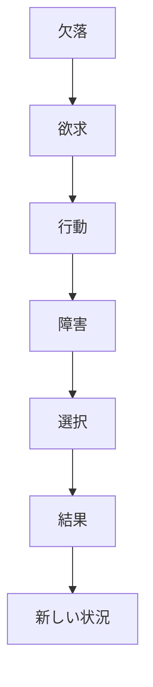
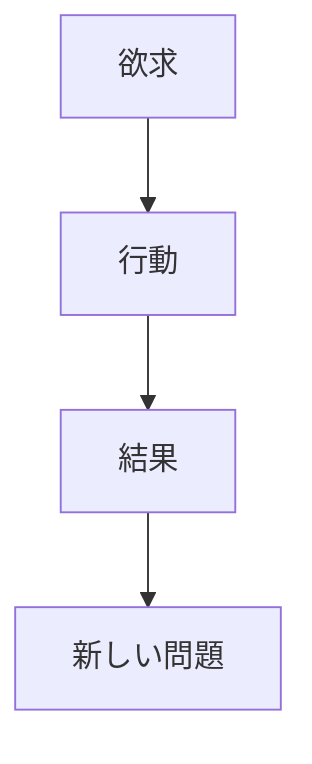
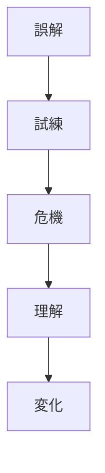
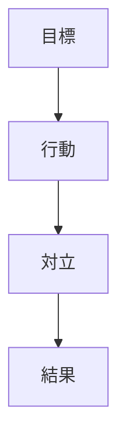
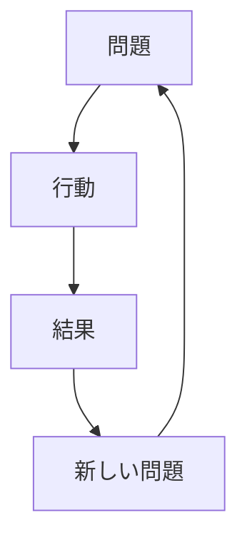

# Narrative Mechanics

Narrative Mechanics は、物語がどのような因果構造によって動くのかを説明する構造である。

物語は単なる出来事の列ではない。  
物語は

- 欠落
- 欲求
- 障害
- 選択
- 結果

という因果連鎖によって進む。

この連鎖を理解することで、  
物語の推進力を分析できる。

---

# 基本メカニズム

---

# 物語の推進力

物語は次の4つの要素で動く。

## 欠落（Lack）

主人公が持っていないもの。

例

- 愛
- 居場所
- 自信
- 権力
- 真実

欠落があることで、物語が始まる。

---

## 欲求（Desire）

主人公が得ようとするもの。

例

- 恋人
- 勝利
- 真相
- 自由

欲求は行動の理由になる。

---

## 障害（Obstacle）

欲求達成を妨げるもの。

例

- 敵
- 社会
- 自分の弱さ
- 誤解

障害があることでドラマが生まれる。

---

## 選択（Choice）

主人公が何を選ぶか。

物語は

**選択の連続**

である。

---

# 因果連鎖

結果は新しい問題を生み、物語が続く。

---

# 内面メカニズム

物語は外的事件だけでなく、  
内面の変化でも動く。

これは Character Arc と密接に関係する。

---

# 外的メカニズム

これは Scene Function と接続する。

---

# 物語の循環

この循環が続くことで、物語は展開する。

---

# 分析テンプレート

作品：

---

## 主人公の欠落

---

## 欲求

---

## 障害

---

## 選択

---

## 結果

---

## 新しい状況

---

# 分析ポイント

- 欠落は明確か
- 欲求は理解できるか
- 障害は十分強いか
- 選択が物語を動かしているか
- 結果が次の問題を生んでいるか

---

# 弱い物語の特徴

## 欲求が弱い

主人公が何をしたいのか不明。

---

## 障害が弱い

簡単に解決してしまう。

---

## 選択がない

偶然や外部要因で進む。

---

## 因果が弱い

出来事がバラバラ。

---

# まとめ

Narrative Mechanics は

**物語がどの因果構造で進むのかを説明する構造**

である。

これにより

- 物語の推進力
- 事件の因果関係
- 人物の選択

を明確に理解できる。