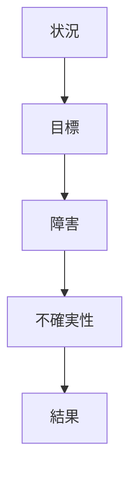
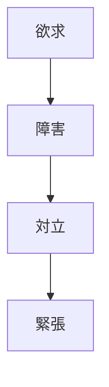
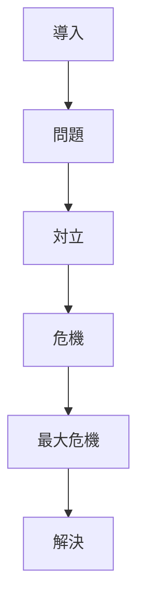

# Tension Structure

Tension（緊張）は、物語の面白さを生む主要な力である。

観客は

- どうなるのか
- 起きるのか
- 失敗するのか
- 成功するのか

という不確定性を感じるとき、物語に引き込まれる。

Tension Structure は、この緊張の作られ方を分析する構造である。

---

# 緊張の基本構造

緊張は

**目標 + 障害 + 不確実性**

で生まれる。

---

# 緊張の発生

---

# 緊張の種類

## Outcome Tension（結果）

成功するか失敗するか。

例

- 勝てるのか
- 生き残れるのか

---

## Moral Tension（道徳）

どちらを選ぶのか。

例

- 正義か友情か
- 復讐か赦しか

---

## Relationship Tension（関係）

人物関係の緊張。

例

- 告白できるのか
- 信頼は回復するのか

---

## Information Tension（情報）

観客と人物の情報差。

例

- 観客だけが知っている秘密
- 主人公だけが知らない真実

---

# 緊張曲線

---

# 緊張を強くする方法

## 1 障害を強くする

- 敵を強くする
- 時間制限を作る
- 賭け金を大きくする

---

## 2 情報差を作る

観客が知っていることを  
登場人物が知らない。

---

## 3 対立を作る

人物同士の欲求を衝突させる。

---

## 4 選択を迫る

どちらを選んでも損失がある。

---

# 緊張分析テンプレート

作品：

---

## 主な緊張