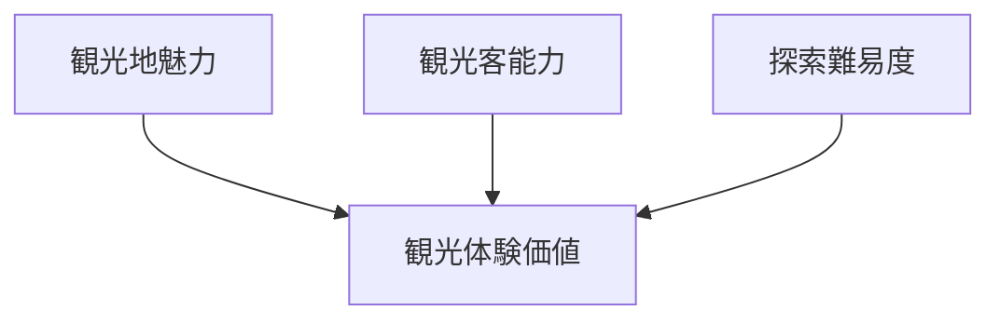
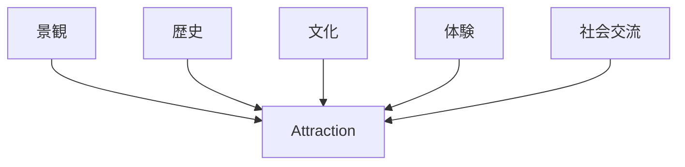
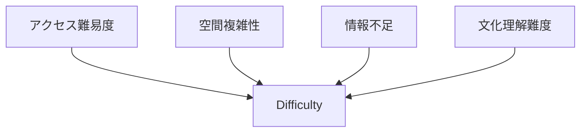
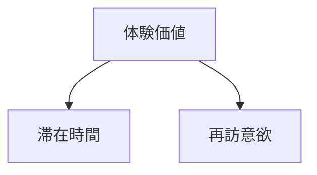
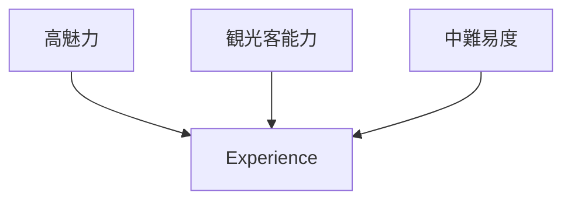
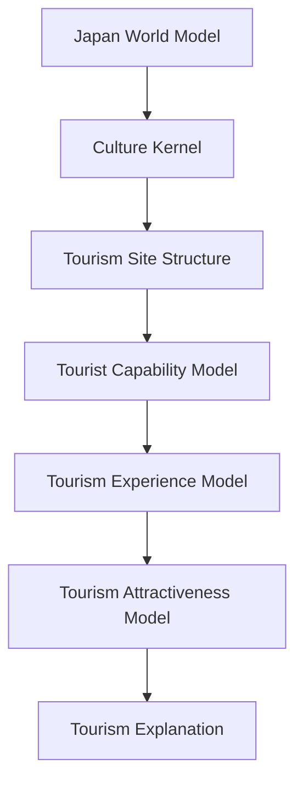

# Tourism Attractiveness Model

Tourism Attractiveness Model は、観光地の魅力度を説明するモデルである。

観光地の価値は

- 観光資源
- 体験構造
- 探索難易度
- 観光客能力

の相互作用によって決まる。

---

# 核心

観光体験価値

**= 観光地魅力 × 観光客能力 ÷ 探索難易度**

---

# 基本構造

---

# 観光地魅力  
Attraction

観光地そのものの魅力。

## 要素

- 景観
- 歴史
- 文化
- 活動
- 社会交流

リンク

[[Tourism Object Taxonomy]]

---

# 魅力構造

---

# 探索難易度  
Difficulty

観光地の理解や探索の難しさ。

## 要素

- 地理的難易度
- 情報不足
- 文化理解の難しさ
- アクセス難易度
- 空間構造

---

# 探索難易度構造

---

# 観光客能力  
Capability

観光客が観光地を体験できる能力。

リンク

[[Tourist Capability Model]]

能力例

- 空間探索能力
- 知識能力
- 文化理解能力
- 社会交流能力
- 身体能力

---

# 滞在時間との関係

観光地魅力は滞在時間に影響する。

---

# 観光地タイプ別の特徴

## テーマパーク

特徴

- 高魅力
- 低難易度

初心者でも楽しめる。

---

## 歴史都市

特徴

- 高魅力
- 中難易度

知識があるほど楽しめる。

---

## 秘境

特徴

- 中魅力
- 高難易度

探索能力が必要。

---

# モデル例

京都

---

# 観光設計への応用

観光地の価値を上げる方法

## 1 魅力を上げる

- 景観保全
- 文化価値提示
- 体験開発

## 2 難易度を下げる

- 案内整備
- ガイド
- 情報提供

## 3 能力を補助する

- ガイドツアー
- 解説
- 教育

---

# 観光OSでの位置

---

# 一言で言うと

観光地の価値は

**魅力・難易度・観光客能力のバランスで決まる。**