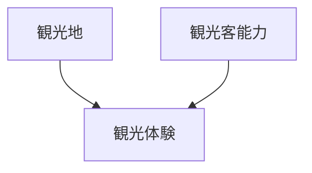
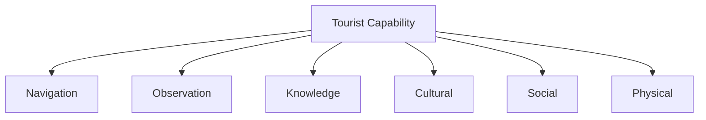
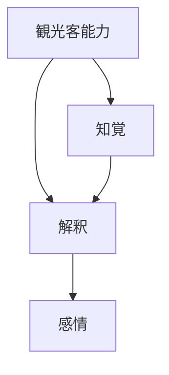
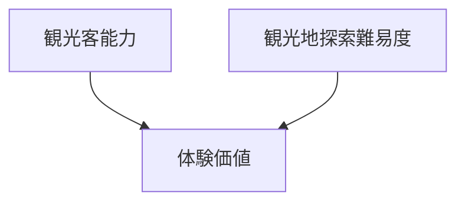
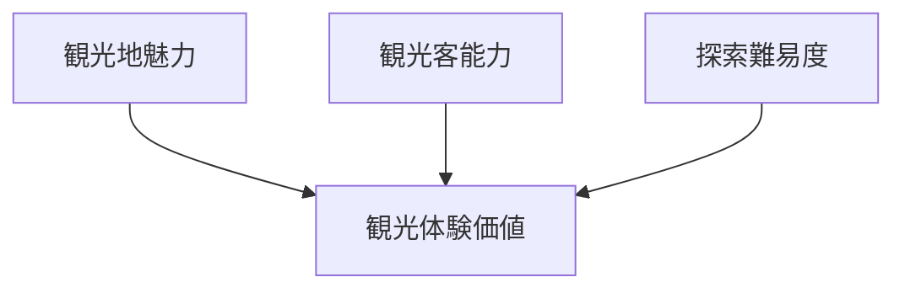
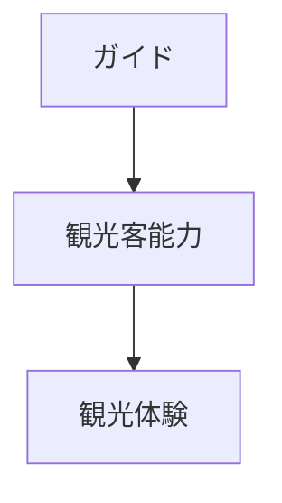
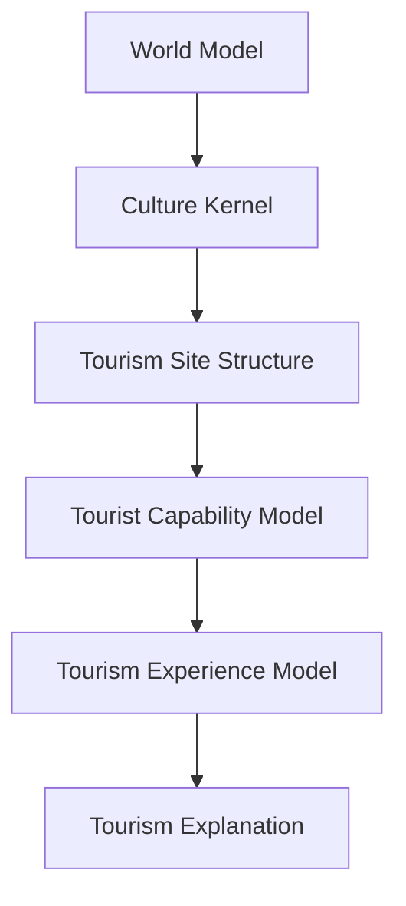

# Tourist Capability Model

Tourist Capability Model は、  
観光客が観光地をどの程度

- 見つけ
- 理解し
- 体験できるか

を説明する能力モデルである。

観光体験の質は

**観光地の魅力だけでなく観光客の能力にも依存する。**

---

# 核心

観光体験の価値

= 観光資源 × 観光客能力

---

# 基本構造

---

# 観光客能力の構成

観光客能力は複数の能力から構成される。

---

# 1 空間探索能力  
Navigation Ability

観光地を

- 見つける
- 移動する
- 空間を理解する

能力。

例

- 地図読解
- 方向感覚
- 交通理解

能力が低い場合

- 観光地に到達できない
- 空間構造を理解できない

---

# 2 観察能力  
Observation Ability

景観や対象の特徴に

**気づく能力**

例

- 建築の違い
- 景観の構造
- 季節の変化

能力が低い場合

- 重要な対象を見落とす

---

# 3 知識能力  
Knowledge Ability

対象を理解するための知識。

例

- 歴史
- 宗教
- 建築
- 地理

知識があると

- 解釈が深くなる

---

# 4 文化理解能力  
Cultural Literacy

文化の意味を理解する能力。

例

- 宗教観
- 社会規範
- 美意識

能力が低い場合

- 文化の意味を誤解する

---

# 5 社会交流能力  
Social Ability

現地の人と交流する能力。

例

- 言語
- コミュニケーション
- 礼儀

能力が高いと

- 地域文化を深く体験できる

---

# 6 身体能力  
Physical Ability

観光地を実際に移動する能力。

例

- 歩行能力
- 体力
- 登山能力

能力が低い場合

- 一部観光地にアクセスできない

---

# 観光体験との関係

---

# 探索難易度との関係

観光地には探索難易度がある。

---

# 体験価値モデル

観光体験の価値

---

# 観光客タイプ

能力によって観光客タイプは変わる。

## 初心者観光客

特徴

- 知識が少ない
- 探索能力が低い

好む観光地

- 分かりやすい景観
- 有名観光地

---

## 中級観光客

特徴

- 基本知識あり
- 探索可能

好む観光地

- 歴史都市
- 文化施設

---

## 上級観光客

特徴

- 高い知識
- 強い探索能力

好む観光地

- 地方文化
- マイナー遺産
- 深い文化体験

---

# ガイドの役割

ガイドは

**観光客能力を補助する存在**

である。

ガイドは

- 知識
- 解釈
- 導線

を補助する。

---

# 観光OSでの位置

---

# 一言で言うと

観光体験とは

**観光地の魅力と観光客の能力の相互作用**

である。