# Tourism Experience Model

Tourism Experience Model は、観光客が観光地をどのように

- 知覚し
- 理解し
- 感情を動かされ
- 記憶するか

を説明する構造モデルである。

観光は単なる移動ではなく、

**知覚 → 解釈 → 感情 → 記憶**

の連鎖によって成立する。

---

# 核心

観光体験の価値は、  
観光資源そのものだけでなく、

**観光客が何を知覚し、どう意味づけたか**

によって決まる。

---

# 基本構造

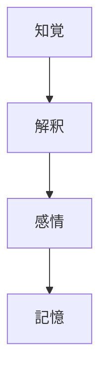

---

# 全体構造

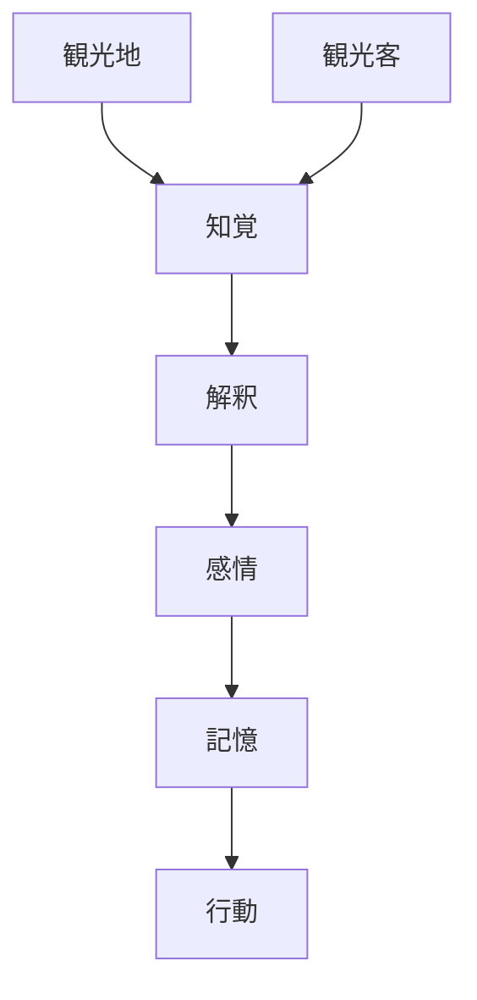

---

# 1 知覚  
Perception

知覚とは、観光客が現地で対象を

- 見る
- 聞く
- 嗅ぐ
- 触れる
- 移動する

ことによって受け取る感覚入力である。

## 主な知覚対象

- 景観
- 音
- 匂い
- 温度
- 混雑
- 空間の広がり
- 建築の大きさ
- 自然の迫力

## 観光上の意味

観光体験はまず知覚されなければ始まらない。  
見えないもの、気づかれないものは体験になりにくい。

---

# 2 解釈  
Interpretation

解釈とは、知覚したものに意味を与える過程である。

観光客は対象を

- 何か
- なぜ重要か
- どう見るべきか

として理解する。

## 解釈を左右する要素

- 事前知識
- ガイド説明
- 言語能力
- 興味関心
- 世界観
- 比較対象の有無

## 観光上の意味

同じ景色でも、

- ただの建物
- 歴史遺産
- 宗教空間
- 生活文化の象徴

のどれとして理解するかで体験価値は大きく変わる。

---

# 3 感情  
Emotion

感情とは、知覚と解釈の結果として生まれる反応である。

主な観光感情

- 美しい
- 面白い
- 驚いた
- 神聖だ
- 落ち着く
- 懐かしい
- 異文化的だ
- 感動した

## 観光上の意味

感情が動かなければ、観光体験は「情報」で終わりやすい。  
感情が動くことで「経験」になる。

---

# 4 記憶  
Memory

記憶とは、観光体験が後から思い出され、再評価される層である。

記憶に残りやすい要素

- 強い感情
- 物語
- 象徴的景観
- 参加体験
- 他者との共有
- 写真映え
- 非日常性

## 観光上の意味

観光の価値は現地だけでなく、

- 再訪意欲
- 推薦意欲
- 長期的印象

にも現れる。

---

# 補助構造

観光体験は次の補助要因によって強化または阻害される。

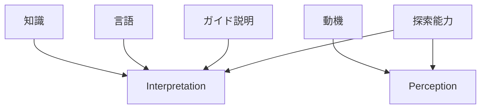

---

# 観光体験の成立条件

観光体験が深くなるには次の条件が重要である。

## 1 気づけること
対象が知覚可能であること。

## 2 分かること
意味を解釈できること。

## 3 心が動くこと
感情反応が起こること。

## 4 残ること
記憶に定着すること。

---

# 体験深度モデル

観光体験には深さがある。

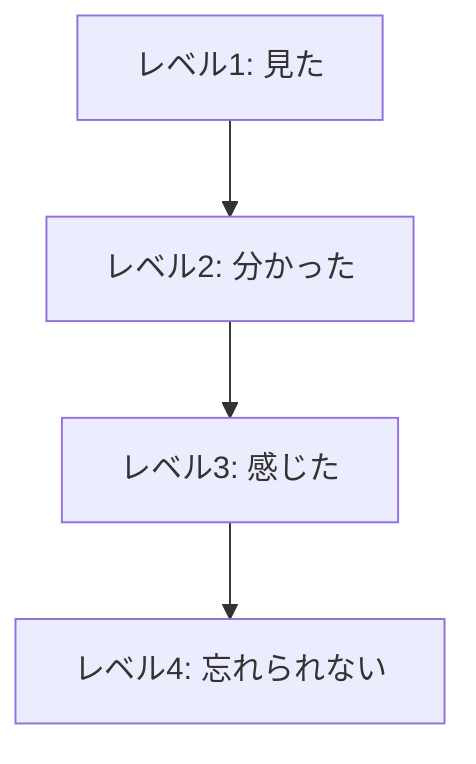

## レベル1 見た
存在を確認しただけ。

## レベル2 分かった
説明を理解した。

## レベル3 感じた
感情が動いた。

## レベル4 忘れられない
個人的意味や記憶になった。

---

# 観光地側との関係

観光体験は観光地構造と対応する。

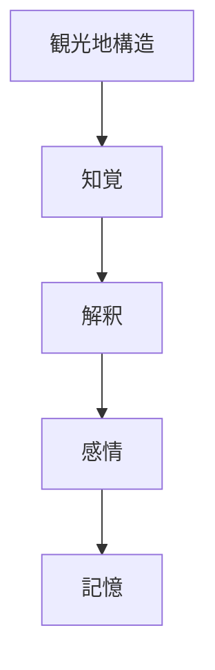

---

# 観光説明との関係

ガイド説明は特に **解釈層** を補強する。

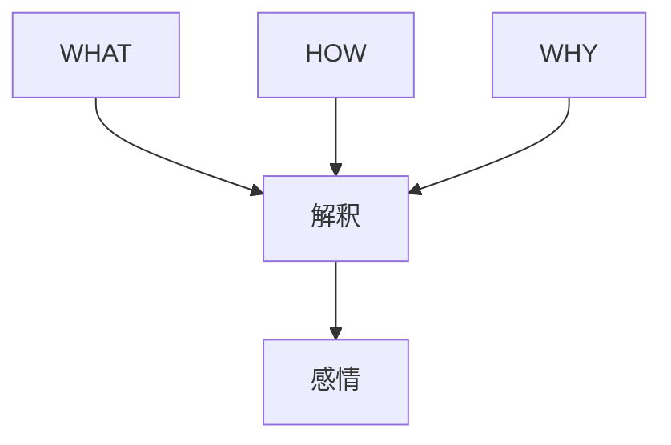

---

# 観光客能力との関係

観光客の能力差によって体験の深さが変わる。

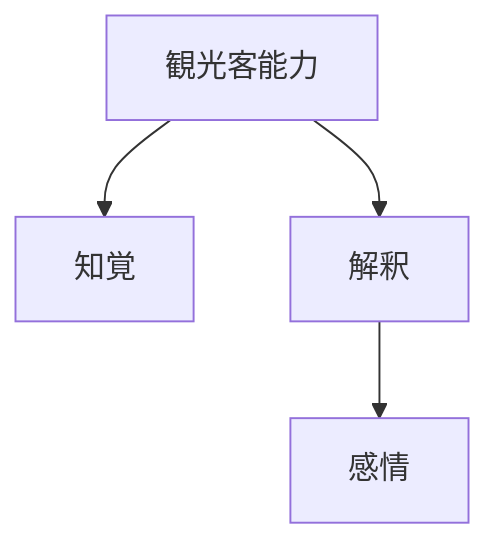

## 例

- 地理感覚が弱い → 景観や文脈を捉えにくい
- 歴史知識がある → 歴史型観光地の解釈が深くなる
- 宗教知識がある → 神社や寺院の意味を理解しやすい

---

# 典型パターン

## 景観型観光地

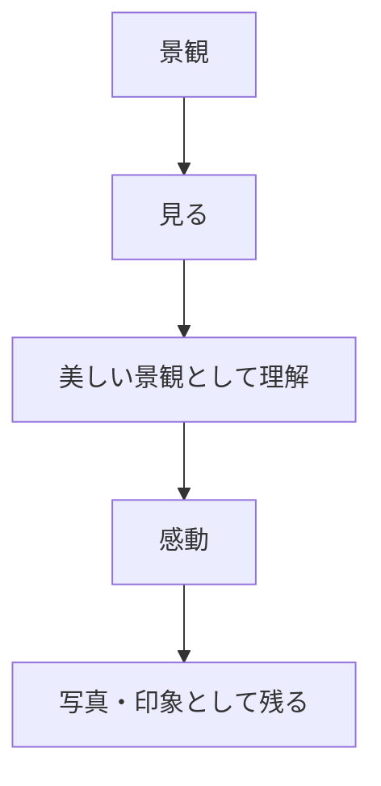

---

## 歴史型観光地

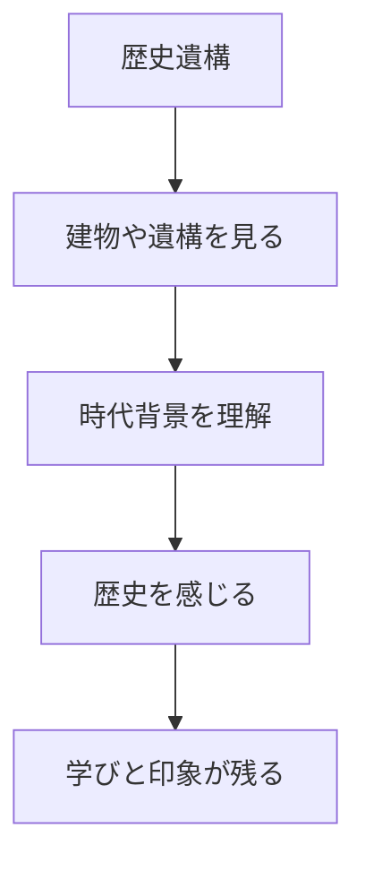

---

## 宗教・文化型観光地

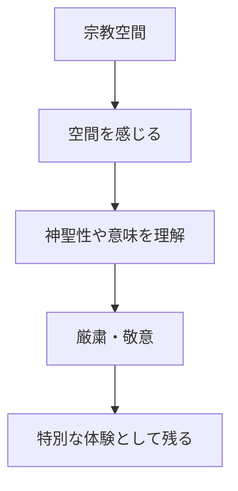

---

# 実務上の含意

## ガイドにとって重要なこと

ガイドの役割は、単に情報を伝えることではなく、

- 気づかせる
- 分からせる
- 感じさせる
- 記憶に残す

ことである。

## 観光設計にとって重要なこと

観光商品は、

- 見せるだけ
では弱い。

必要なのは

- 知覚しやすい導線
- 解釈を助ける情報
- 感情が動く演出
- 記憶に残る物語

である。

---

# 観光OSでの位置

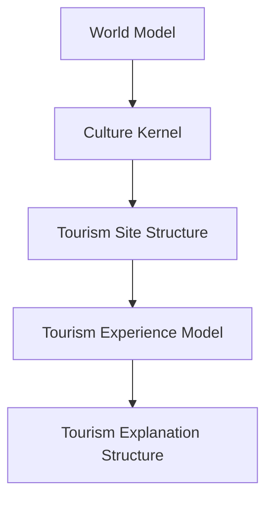

---

# 一言で言うと

観光体験とは

**見たものに意味を与え、感情が動き、記憶になる過程**である。