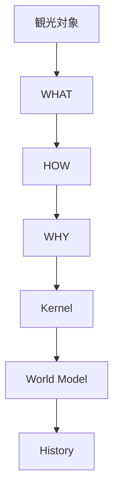
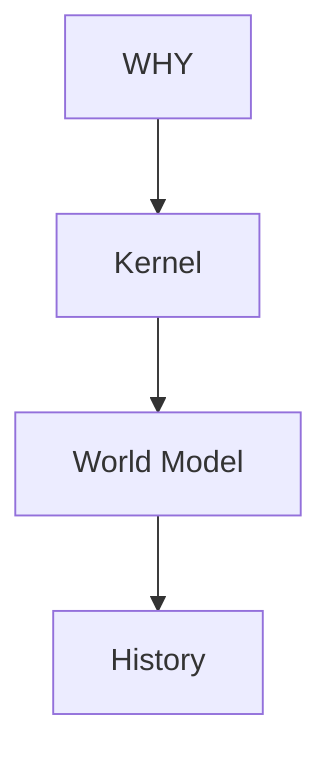
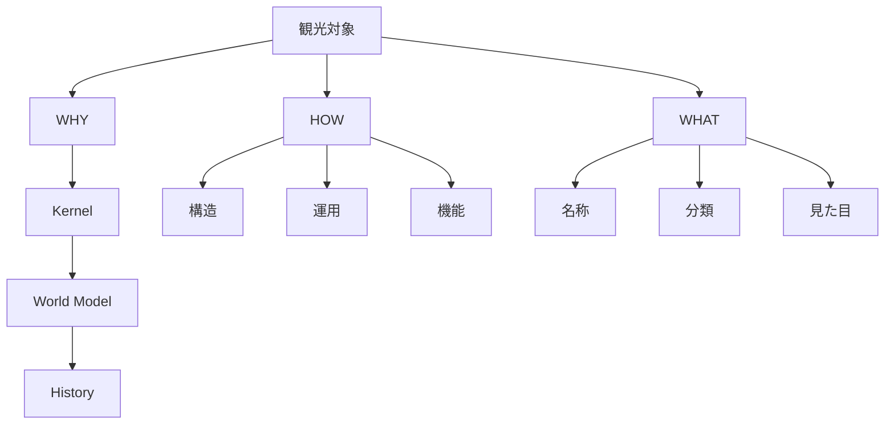
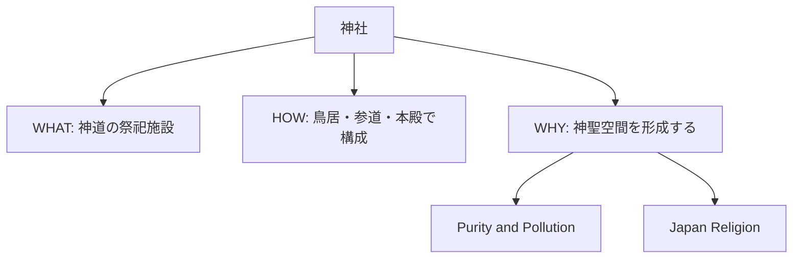
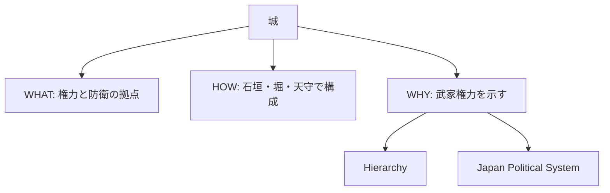
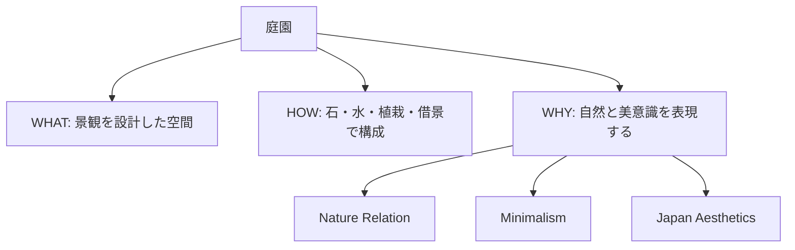
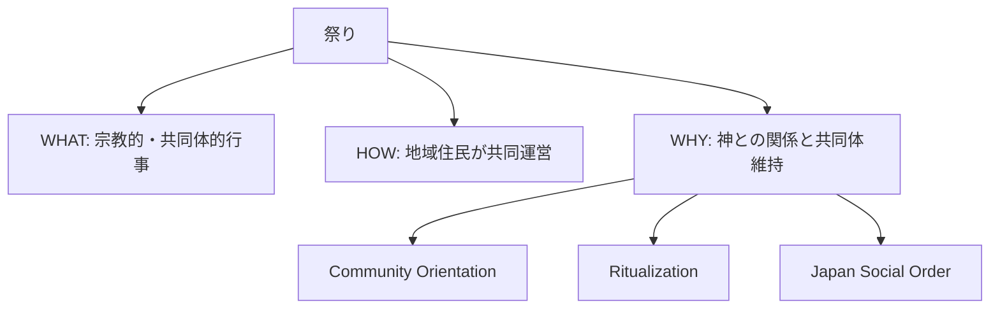

# Tourism Explanation Structure

Tourism Explanation Structure は、観光地・文化財・風景・行事を  
**WHAT / HOW / WHY** の3層で説明するための構造である。

目的は、訪日外国人に対して単なる情報提示ではなく、

- 何であるか
- どのように成立しているか
- なぜそのような意味を持つのか

まで説明できるようにすることである。

---

# 核心

観光説明は単なる名称紹介ではない。

良い説明は次の3層を持つ。

- WHAT = 何か
- HOW = どう成り立っているか
- WHY = なぜ重要か

さらに必要に応じて

- Kernel
- World Model
- History

まで接続する。

---

# 基本構造

---

# 3層構造

## 1 WHAT

対象そのものを示す層。

内容

- 名称
- 種類
- 所在地
- 外見
- 基本機能

例

- 神社
- 城
- 庭園
- 祭り
- 仏像

質問

- これは何か
- どこにあるか
- 何のためのものか

---

## 2 HOW

対象の成立・構成・運用を示す層。

内容

- どう作られたか
- どう使われるか
- どう維持されるか
- どのような要素で成り立つか

例

- 神社は参道、鳥居、拝殿、本殿で構成される
- 城は防御構造として石垣や堀を持つ
- 茶道は一定の作法によって運営される

質問

- どのように成立しているか
- どんな構造か
- どう機能するか

---

## 3 WHY

対象の意味・価値・背景を示す層。

内容

- なぜ存在するか
- なぜ重視されるか
- なぜ日本文化で重要か
- どの文化原理と関係するか

例

- 鳥居は神聖空間の境界を示す
- 桜は無常観と結びつく
- 茶室の簡素さは簡素美の表れである

質問

- なぜその形なのか
- なぜそれが価値を持つのか
- なぜ日本人にとって重要なのか

---

# 拡張構造

WHYの背後にはさらに3層ある。

---

## Kernel

文化原理に接続する。

例

- [[Nature Relation]]
- [[Impermanence]]
- [[Ritualization]]
- [[Harmony]]
- [[Minimalism]]

---

## World Model

社会構造に接続する。

例

- [[Japan Geography]]
- [[Japan Religion]]
- [[Japan Social Order]]
- [[Japan Political System]]
- [[Japan Economy]]
- [[Japan Aesthetics]]

---

## History

時代背景に接続する。

例

- 古代
- 中世
- 近世
- 近代

---

# 観光説明のフル構造

---

# 説明テンプレート

## 最小テンプレート

### WHAT
これは何か。

### HOW
どう成り立っているか。

### WHY
なぜ重要か。

---

## 完全テンプレート

### WHAT
- 名称
- 種類
- 所在地
- 基本機能

### HOW
- 構造
- 成立過程
- 利用方法
- 維持方法

### WHY
- 文化的意味
- 社会的意味
- 歴史的意味

### Kernel
- 関係する文化原理

### World Model
- 背景となる社会構造

### History
- 成立した時代背景

---

# 対象別の使い分け

## 神社

---

## 城

---

## 庭園

---

## 祭り

---

# 説明レベル

## レベル1 名前説明
WHATだけ

例  
「これは神社です」

---

## レベル2 構造説明
WHAT + HOW

例  
「これは神社で、鳥居の内側が神聖空間です」

---

## レベル3 文化説明
WHAT + HOW + WHY

例  
「これは神社で、鳥居は神聖空間の境界を示し、日本文化では清浄な空間が重視されます」

---

## レベル4 文明説明
WHAT + HOW + WHY + Kernel + World Model

例  
「これは神社で、神聖空間を区切る構造を持ち、清浄原理や日本宗教構造と関係しています」

---

# ガイド運用ルール

## 1. まず WHAT を明確にする
相手が対象を認識できないまま深い説明をしない。

## 2. 次に HOW を簡潔に示す
形・機能・仕組みを伝える。

## 3. 最後に WHY を伝える
文化や歴史の意味に接続する。

## 4. 相手の理解度で深さを変える
- 観光客一般 → WHAT / HOW 中心
- 知的関心が高い相手 → WHY / Kernel まで
- 専門的関心が強い相手 → World Model / History まで

---

# この構造の役割

この構造を使うことで、観光説明は

- 名前紹介
- 雑学説明
- 断片知識

ではなく、

**文化と文明を接続する説明**

になる。

---

# 一言で言うと

観光説明とは

**対象を文化原理と社会構造に接続して語ること**である。