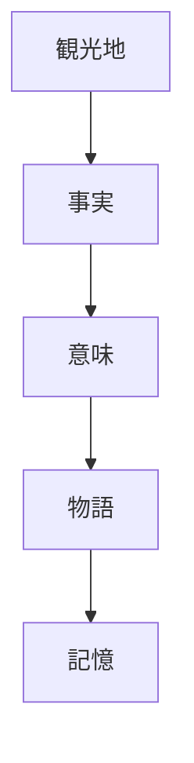
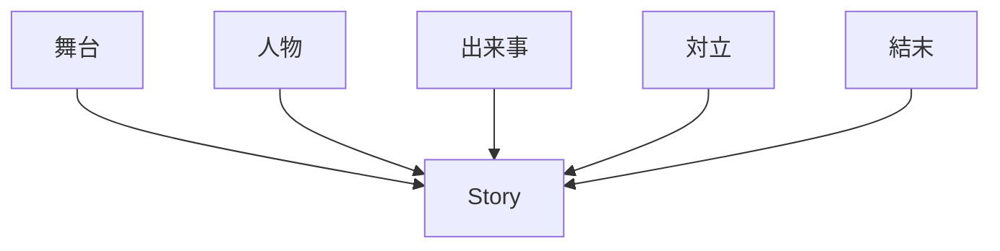
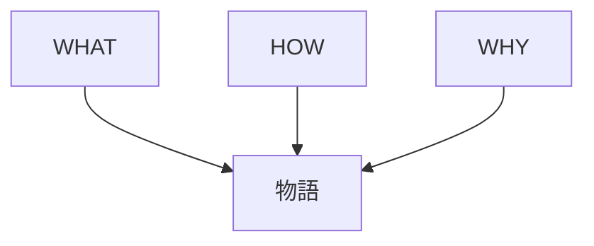
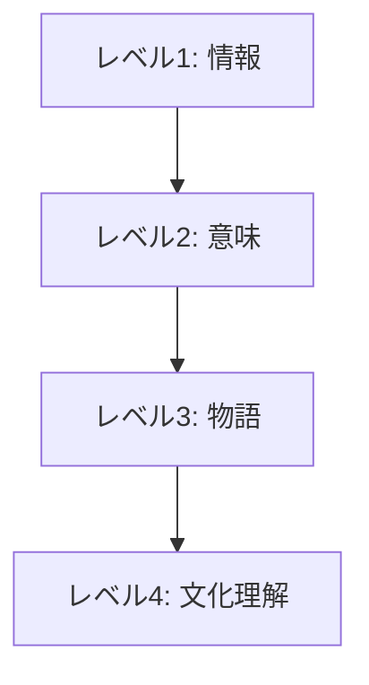
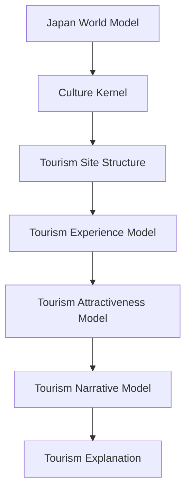

# Tourism Narrative Model

Tourism Narrative Model は、観光地の説明を  
**単なる情報ではなく物語として構造化するモデル**である。

観光客の記憶に残る体験は、

**事実 → 意味 → 物語**

の構造を持つ。

---

# 核心

観光体験は

**場所ではなく物語として記憶される**

---

# 基本構造

---

# 観光物語の構成

観光物語は次の要素から構成される。

---

# 1 舞台  
Setting

物語の場所。

例

- 京都
- 奈良
- 富士山
- 城

舞台は観光地そのもの。

---

# 2 人物  
Character

物語を動かす人物。

例

- 天皇
- 将軍
- 僧侶
- 職人
- 武士

人物が入ると歴史が生きた物語になる。

---

# 3 出来事  
Event

歴史的出来事や文化的行為。

例

- 戦い
- 建築
- 宗教儀礼
- 政治事件

---

# 4 対立  
Conflict

物語の緊張。

例

- 政治争い
- 戦争
- 宗教対立
- 社会変化

対立があると話が面白くなる。

---

# 5 結末  
Resolution

現在の観光地につながる結果。

例

- 城が残った
- 寺が建立された
- 都市が発展した

---

# 観光説明との関係

観光説明は

**WHAT / HOW / WHY**

から物語に発展する。

---

# 観光物語の深度

---

# 例

## 城

WHAT  
城

HOW  
防御構造

WHY  
武士の政治拠点

Narrative  
戦国時代の権力争いの舞台

---

## 神社

WHAT  
神社

HOW  
神を祀る

WHY  
自然信仰

Narrative  
地域の信仰と歴史の中心

---

## 京都

WHAT  
古都

HOW  
寺社と町並み

WHY  
日本文化の中心

Narrative  
1000年以上続いた都の物語

---

# 観光OSでの位置

---

# ガイドにとっての意味

良いガイドは

- 情報を説明する人ではない

**物語を語る人である**

---

# 一言で言うと

観光地とは

**物語が宿る場所**

である。