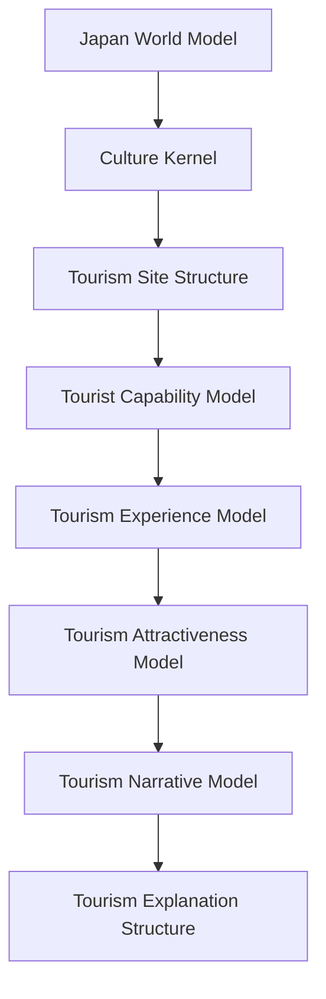
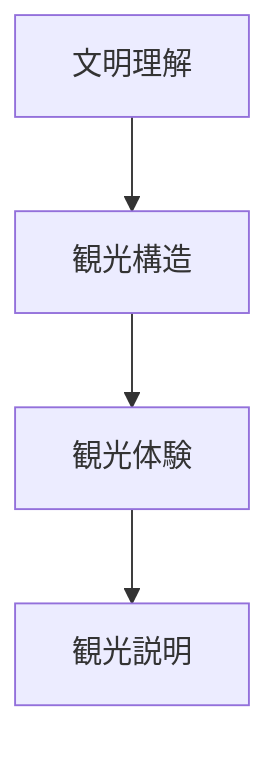
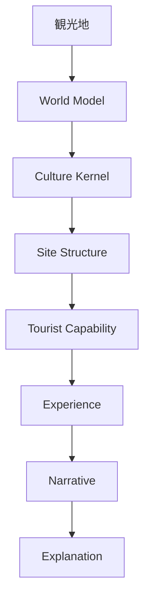

# Tourism OS

Tourism OS は、観光地を

- 理解
- 分析
- 説明

するための思考OSである。

このOSは

**文化理解 → 観光体験 → 観光説明**

の流れで構成される。

---

# 全体構造

---

# レイヤー構造

---

# 1 文明理解

観光地の文化背景を理解する。

## World Model

[[Japan World Model]]

- Geography
- Religion
- Social Order
- Political System
- Economy
- Aesthetics

## Culture Kernel

[[00 Japanese Culture Kernel]]

例

- Nature Relation
- Impermanence
- Ritualization
- Harmony
- Minimalism

---

# 2 観光構造

観光地の構造を理解する。

## 観光対象分類

[[Tourism Object Taxonomy]]

観光対象

- 景観
- 歴史
- 宗教文化
- 体験
- 自然
- 社会交流

## 観光地構造

[[Tourism Site Structure]]

---

# 3 観光体験

観光客がどのように体験するか。

## 観光客能力

[[Tourist Capability Model]]

- 探索能力
- 知識
- 文化理解
- 社会能力
- 身体能力

## 観光体験

[[Tourism Experience Model]]

- 知覚
- 解釈
- 感情
- 記憶

## 観光魅力

[[Tourism Attractiveness Model]]

観光体験価値

= 魅力 × 能力 ÷ 難易度

---

# 4 観光説明

観光体験を説明する構造。

## 観光物語

[[Tourism Narrative Model]]

観光地は

**物語として記憶される**

## 観光説明

[[Tourism Explanation Structure]]

説明構造

- WHAT
- HOW
- WHY

---

# 観光OSの流れ

---

# 観光OSの目的

このOSの目的は

観光地を

- 単なる場所
ではなく

**文化と物語の場**

として理解し説明することである。

---

# 一言で言うと

観光とは

**文明を体験することである。**