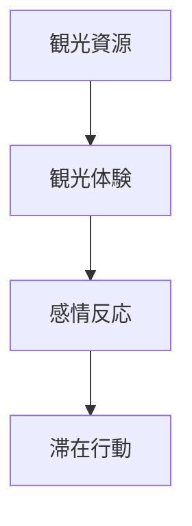
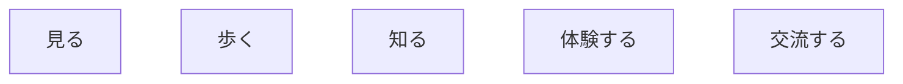
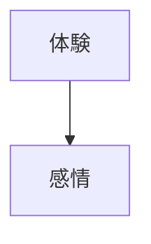
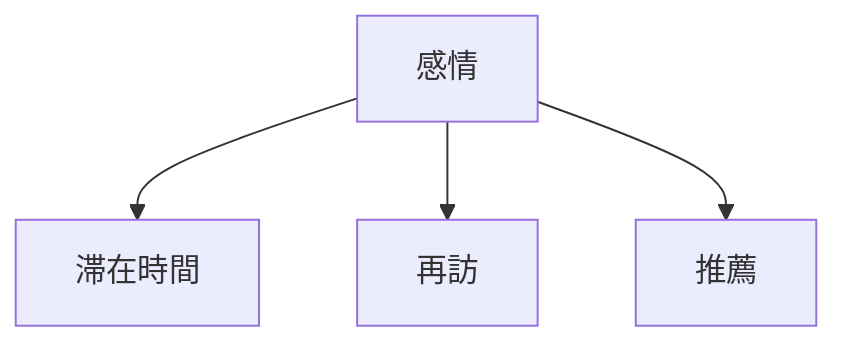
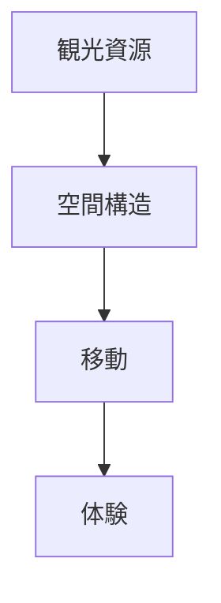
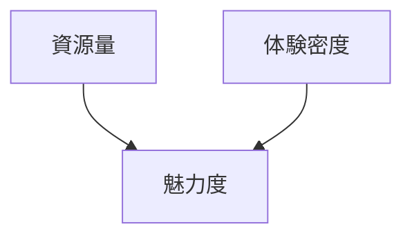
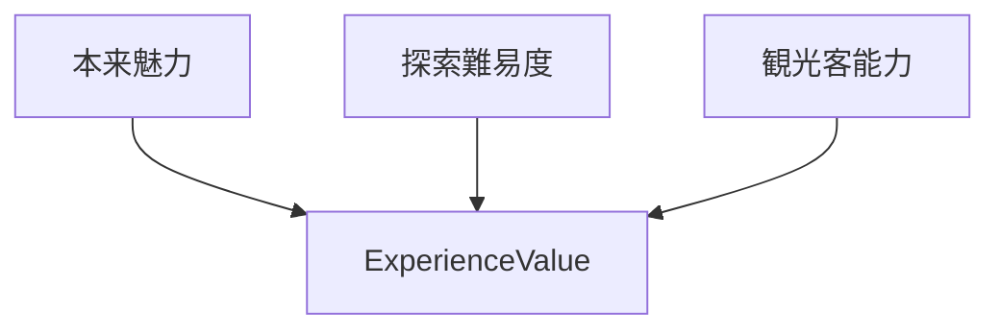
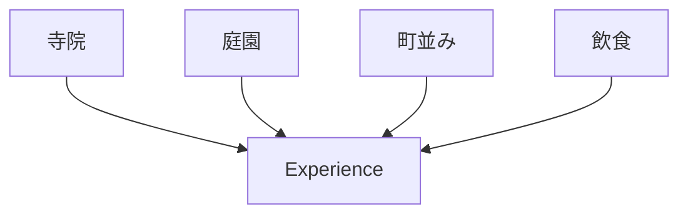
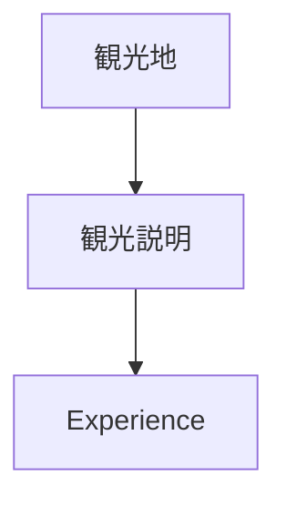
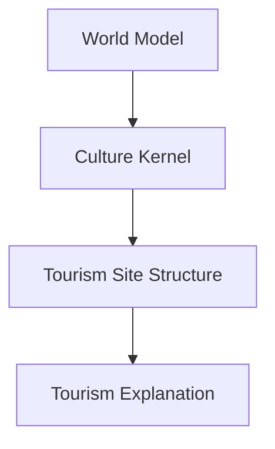

# Tourism Site Structure

Tourism Site Structure は、  
観光地がどのように

- 観光体験
- 滞在時間
- 満足度

を生み出すかを説明する構造モデルである。

観光地は単なる場所ではなく、

**資源 → 体験 → 感情 → 滞在**

というプロセスで成立する。

---

# 核心

観光地の魅力は

**観光資源 × 体験構造**

によって生まれる。

---

# 基本構造

---

# 観光資源

観光地に存在する要素。

## 資源タイプ

- 景観
- 歴史
- 文化
- 活動
- 自然
- 社会

リンク

[[Tourism Object Taxonomy]]

---

# 体験構造

観光客が実際に行う行動。

---

# 感情反応

体験は感情を生む。

主な観光感情

- 美しい
- 面白い
- 神聖
- 歴史を感じる
- 非日常

---

# 滞在行動

感情は観光行動に影響する。

- 滞在時間
- 再訪意欲
- 推薦

---

# 観光地の構造

観光地は次の層を持つ。

---

# 観光地の評価構造

観光地の魅力は

**資源 × 体験密度**

で決まる。

---

# 探索難易度との関係

観光地の魅力は  
観光客の能力との関係でも変化する。

---

# 観光地構造の例

京都

---

# 観光説明との関係

---

# 観光OSでの位置

---

# 一言で言うと

観光地とは

**資源が体験を生み、体験が感情を生み、感情が滞在を生む場所**

である。