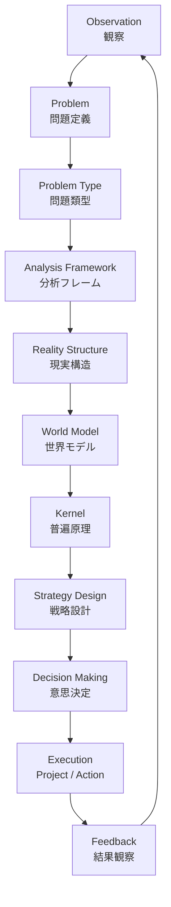

# 0 思考フロー

# 1 OSの基本構造

Vaultは次の階層で動く。

Purpose / Strategy（hub）  
↓  
Structures（分析OS）  
↓  
World Model（世界の構造）  
↓  
Kernel（普遍原理）  
↓  
Domain / Case  
↓  
Execution

意味

|層|役割|
|---|---|
|Hub|目的・人生戦略|
|Structures|問題解決OS|
|World Model|社会の構造理解|
|Kernel|普遍原理|
|Domain|分野知識|
|Execution|行動|

---

# 2 OSの基本サイクル

思考は次の順で進む。

Observation  
↓  
Problem  
↓  
Analysis  
↓  
Model  
↓  
Kernel  
↓  
Action

Vaultでは

observation  
↓  
problem  
↓  
analysis framework  
↓  
world model  
↓  
kernel  
↓  
execution

---

# 3 日常運用フロー

日常の質問・出来事は次の順で処理する。

## Step1 観察

structures/observationに記録

### 例
- 同僚が辞める  
- 観光地が混雑する  
- SNSが炎上する

### 使うノート
- [[観察構造]]  
- [[データ構造]] 
- [[パターン構造]]  
- [[事例構造]]

---

### Step2 問題化

structures/problemで問題定義

### 例
- 人が定着しない  
- 観光地が荒れる  
- SNS炎上

### 使うノート
- [[問題構造]]  
- [[問題定義構造]]

---

### Step3 問題類型を判定

structures/problem typeから問題タイプを選ぶ。タイプは複数ある場合もある。

- [[02_zettelkasten/01_knowledge/world_model/model/social/efficiency/00 efficiency Hub]]  
- [[02_zettelkasten/01_knowledge/world_model/model/social/competition/00 competition Hub]]  
- [[02_zettelkasten/01_knowledge/world_model/model/social/power/00 power Hub]]  
- [[02_zettelkasten/01_knowledge/world_model/model/social/coordination/00 coordination Hub]]  
- [[02_zettelkasten/01_knowledge/world_model/model/social/incentive/00 incentive Hub]]  
- [[02_zettelkasten/01_knowledge/world_model/model/social/information/00 information Hub]]

### 例
- 人が辞める→ incentive problem

---

### Step4 分析フレームを選ぶ

structures/analysis framework
- [[02_zettelkasten/02_process/methods/analysis/00 Analysis Framework hub]]

---

### Step5 現実構造を見る

structures/reality structure

例

organization  
market  
institution  
technology

---

### Step6 world modelで整理

world_modelで社会構造を確認
- [[00 World Category Hub]]

例

組織  
市場  
国家  
文化  
制度

---

### Step7 kernelで原理を見る

kernel

例

モラルハザード  
参入障壁  
ネットワーク効果  
ボトルネック支配

---

### Step8 解決策

problem solving

で

strategy design  
decision making  
optimization

を使う

---

### Step9 実行

hub/02 Execution

に落とす

project  
action

---

# 4 ノート作成ルール

### observation

作る条件

現実の出来事

例

バス会社で新人が辞める

---

### problem

作る条件

なぜ起きるか分からない

---

### structure

作る条件

複数問題で使える

例

ボトルネック分析  
因果連鎖

---

### kernel

作る条件

普遍原理

例

逆選択  
ネットワーク効果

---

### world model

作る条件

社会構造

例

組織  
市場  
制度

---

# 5 Structureの使い方

Structureは

分析ツール箱

である。

主な種類

### system model

フロー  
状態遷移  
フィードバック

---

### problem solving

問題定義  
原因分析  
戦略設計

---

### analysis framework

ボトルネック  
コストベネフィット  
ステークホルダー

---

### reality structure

人間  
組織  
市場  
制度

---

# 6 kernelの使い方

kernelは

普遍原理

なので

**結論説明に使う。**

例

新人が辞める  
↓  
モラルハザード

---

# 7 Hubの役割

Hubは

OSの司令塔

である。

流れ

Purpose  
↓  
Strategy  
↓  
Execution

---

# 8 OSの実際の使用例

例

人が辞める

↓

Observation  
新人が辞めた

↓

Problem  
定着しない

↓

Problem Type  
incentive

↓

Analysis  
root cause analysis

↓

Reality  
organization

↓

Kernel  
モラルハザード

↓

Solution  
報酬設計

---

# 9 OSの一番重要なルール

ノートは

少なく  
深く

作る。

目安

|層|数|
|---|---|
|kernel|60|
|world model|10|
|structure|50|
