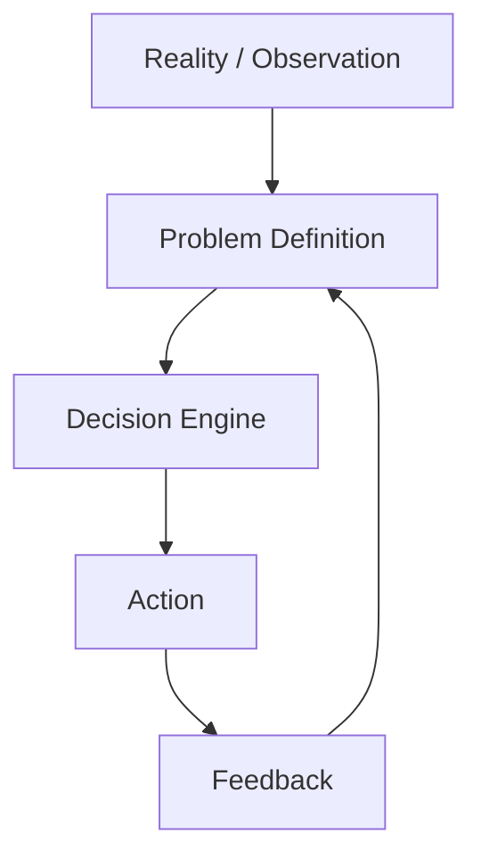

# Problem Definition

## 1 状況

何が起きているか

-

観察事実

-
-

---

## 2 問題の型

該当するもの

- [ ] 効率問題（無駄・非効率）
- [ ] 競争問題（市場・政治）
- [ ] 協調問題（組織・信頼）
- [ ] インセンティブ問題（誘因設計）
- [ ] 情報問題（不確実性・誤認）
- [ ] 制約問題（資源不足）

---

## 3 本当に解くべき問題

表面的問題

-

真の問題（仮説）

-

---

## 4 目的

短期目的

-

長期目的

-

---

## 5 成功条件

成功とは何か

-

測定方法

-

---

## 6 影響範囲

誰に影響するか

-

ステークホルダー

-

---

## 7 制約

時間

-

資金

-

制度

-

能力

-

---

## 8 決めるべきこと

今回の意思決定

-

---

## 9 先送り可能か

- [ ] 今決める必要あり
- [ ] 情報不足のため保留

---

## 10 次の分析

- [[インセンティブ分析]]
- 制約分析
- 選択肢設計

