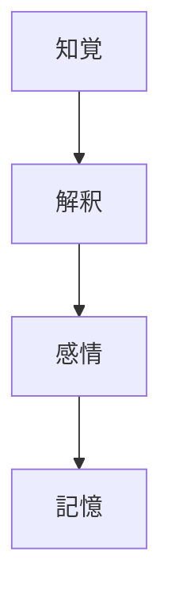
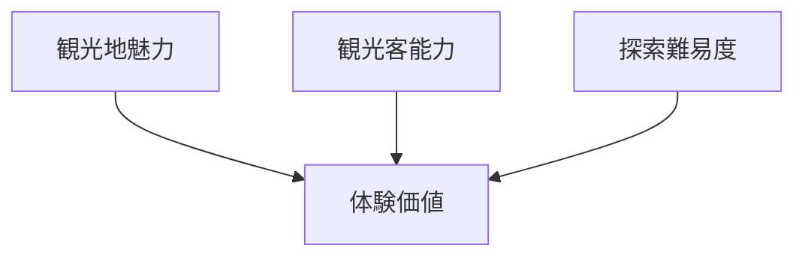
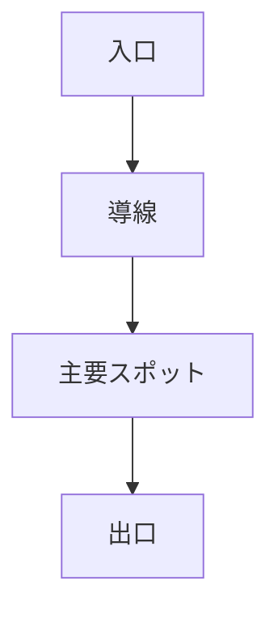

# Tourism Site Analysis

観光地を **構造的に分析するためのテンプレート**。

このテンプレートでは

- 観光対象
- 体験
- 文化背景
- 魅力度

を一つのノートで整理する。

---

# 基本情報

## 観光地名
（例：清水寺）

## 所在地
（例：京都市東山区）

## 観光分類

[[Tourism Object Taxonomy]]

例

- 景観型
- 歴史型
- 宗教文化型

---

# WHAT  
対象の基本説明

これは何か。

例

- 寺院
- 城
- 景観
- 町並み

---

# HOW  
成立構造

どのような構造か。

例

- 建築構造
- 空間構造
- 儀礼
- 活動

---

# WHY  
文化的意味

なぜ重要なのか。

例

- 宗教
- 歴史
- 社会
- 美意識

---

# Culture Kernel

関係する文化原理

例

- [[Nature Relation]]
- [[Impermanence]]
- [[Harmony]]
- [[Ritualization]]
- [[Minimalism]]

---

# World Model

文化背景

例

- [[Japan Religion]]
- [[Japan Social Order]]
- [[Japan Political System]]
- [[Japan Aesthetics]]

---

# 観光資源

この観光地の資源

- 景観
- 歴史
- 文化
- 活動

---

# 体験要素

観光客が行う体験

- 見る
- 歩く
- 学ぶ
- 参加する
- 交流する

---

# Narrative  
観光物語

この場所の物語。

例

- 建立の歴史
- 人物
- 事件
- 文化

---

# 観光体験モデル

---

# 観光魅力度

観光体験価値

---

# 滞在構造

---

# 強み

この観光地の強い要素

- 景観
- 歴史
- 文化
- 体験

---

# 弱み

課題

- アクセス
- 情報不足
- 混雑
- 魅力不足

---

# ガイド説明

### WHAT

### HOW

### WHY

---

# 一言説明

30秒説明

---
****
# 一言で言うと

この観光地は

**（例：日本宗教文化を体験できる寺院）**