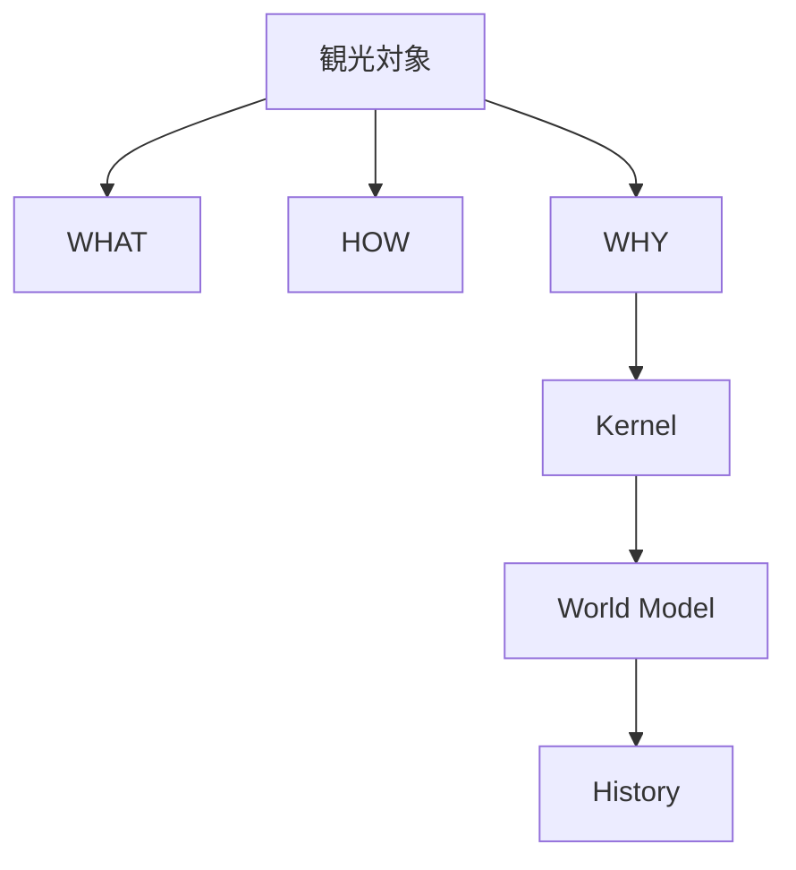
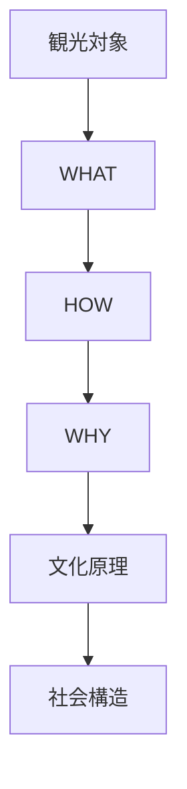

# Tourism Object Templates

Tourism Object Templates は、日本の主要観光対象を  
**WHAT / HOW / WHY** の構造で説明するためのテンプレート集である。

このテンプレートにより、ガイドは

- 短時間
- 正確
- 文化的背景付き

で説明できる。

---

# 基本説明構造

---

# 神社テンプレート

### WHAT
神道の祭祀施設。

### HOW
構造

- 鳥居
- 参道
- 拝殿
- 本殿

鳥居は神聖空間の入口を示す。

### WHY

神道では

- 自然
- 神

が存在すると考えられる。

神社はその神を祀る場所。

### Kernel

- [[Nature Relation]]
- [[Purity and Pollution]]
- [[Ritualization]]

### World Model

- [[Japan Religion]]

---

# 寺院テンプレート

### WHAT
仏教の宗教施設。

### HOW

要素

- 山門
- 本堂
- 仏像
- 庭園

宗派ごとに建築や修行方法が異なる。

### WHY

仏教は

- 無常
- 輪廻
- 解脱

などの思想を持つ宗教である。

### Kernel

- [[Impermanence]]
- [[Minimalism]]

### World Model

- [[Japan Religion]]

---

# 城テンプレート

### WHAT
軍事と政治の拠点。

### HOW

構造

- 石垣
- 堀
- 天守
- 曲輪

防御のための構造を持つ。

### WHY

武士社会では

- 領地支配
- 権力

の象徴だった。

### Kernel

- [[Hierarchy]]
- [[Authority and Legitimacy]]

### World Model

- [[Japan Political System]]

---

# 日本庭園テンプレート

### WHAT
自然景観を模した庭園。

### HOW

要素

- 石
- 水
- 植物
- 借景

自然を縮小して表現する。

### WHY

日本文化では

- 自然
- 無常

を美として表現する。

### Kernel

- [[Nature Relation]]
- [[Impermanence]]
- [[Minimalism]]

### World Model

- [[Japan Aesthetics]]

---

# 祭りテンプレート

### WHAT
宗教と共同体の行事。

### HOW

構成

- 神輿
- 行列
- 儀礼
- 地域参加

地域住民が運営する。

### WHY

祭りは

- 神への奉納
- 共同体維持

の役割を持つ。

### Kernel

- [[Community Orientation]]
- [[Ritualization]]

### World Model

- [[Japan Social Order]]
- [[Japan Religion]]

---

# 仏像テンプレート

### WHAT
仏教の信仰対象。

### HOW

特徴

- 仏
- 菩薩
- 明王

それぞれ役割が異なる。

### WHY

仏像は

- 教え
- 救済

を象徴する存在。

### Kernel

- [[Impermanence]]
- [[Symbolism]]

### World Model

- [[Japan Religion]]

---

# 観光説明のフロー

---

# ガイドの実際の説明例

### 神社

WHAT  
神社は神道の宗教施設です。

HOW  
鳥居をくぐると神聖な空間に入ります。

WHY  
神道では自然に神が宿ると考えられているためです。

---

### 城

WHAT  
これは城です。

HOW  
石垣と堀で守られています。

WHY  
武士の権力を示す政治拠点だったからです。

---

# 一言で言うと

観光説明とは

**対象 → 構造 → 文化**

を順に説明することである。