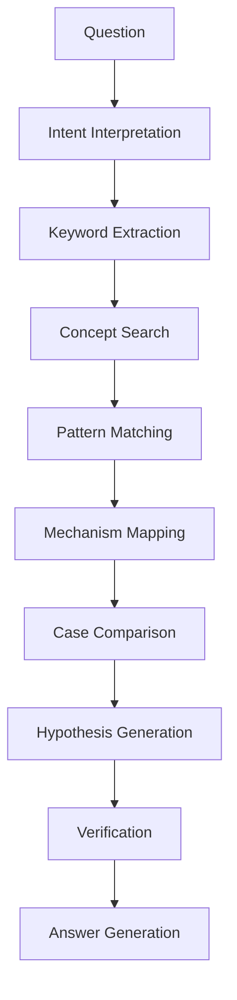
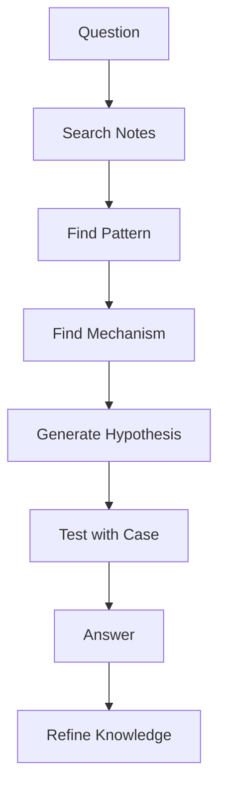

---

layer: system
type: reasoning_engine

---

# 概要

Human Reasoning Engineは  
LLMを使用せず、人間がVaultの知識を使って推論を行うための手順である。

Vaultは以下の知識構造を持つ。

Concept  
Pattern  
Mechanism  
Case  

このエンジンはそれらを探索し、組み合わせ、結論を導く。

---

# 全体構造

---

# 推論ステップ

Human Reasoning Engineは9段階で動作する。

---

# Step1 Question定義

まず質問を明確化する。

## 書き方
- Question  
- 主体  
- 対象  
- 問いの型

例

Question 「韓国併合は植民地化か」
主体 　日本m日本

対象  
韓国併合

問いの型  
分類

---

# Step2 Intent Interpretation

質問のタイプを特定する。

Vaultの問い類型

Explanation  
分類  
比較  
原因  
予測  
設計  
評価

例

分類問題

---

# Step3 Keyword Extraction

質問から概念を抽出する。

例

韓国併合  
植民地  
帝国主義  
統治

これをConceptノートで検索する。

---

# Step4 Concept Search

Concept層を探索する。

対象

Concept  
Domain Concept

例

植民地  
帝国主義  
主権  
国家

---

# Step5 Pattern Matching

ConceptからPatternを探す。

例

帝国拡張パターン  
支配構造パターン  
国家統合パターン

Patternの構造を確認する。

---

# Step6 Mechanism Mapping

Patternの背後にあるMechanismを探す。

例

Power Consolidation Mechanism  
Institution Building Mechanism  
Information Control Mechanism

---

# Step7 Case Comparison

Caseを集めて比較する。

比較軸

主体  
統治方法  
制度  
住民地位

例

韓国併合  
英領インド  
仏領アルジェリア

---

# Step8 Hypothesis Generation

ここまでの情報から仮説を作る。

例

韓国併合は

形式上は国家併合だが  
統治構造は植民地支配である

---

# Step9 Verification

以下のノートを確認する

Concept  
Pattern  
Case

矛盾がないか検証する。

---

# Step10 Answer Generation

回答を書く。

構造

結論  
理由  
証拠  
比較

例

韓国併合は法的には併合であるが  
統治構造を見ると帝国植民地支配の特徴を持つ

---

# 作業フォーマット

作業ノートは以下の形で書く。

Question

Keywords

Concepts

Patterns

Mechanisms

Cases

Hypothesis

Answer

---

# Graph Traversal Method

VaultはKnowledge Graphである。

推論はGraph Traversalとして行う。

探索順

Question  
↓  
Concept  
↓  
Pattern  
↓  
Mechanism  
↓  
Case  
↓  
Answer

---

# 推論モード

質問によって探索順を変える。

---

## Explanation Mode

Concept → Mechanism → Case

---

## Comparison Mode

Case → Pattern → Mechanism

---

## Classification Mode

Concept → Pattern

---

## Design Mode

Mechanism → Pattern → Solution

---

# Human Reasoning Loop

---

# Vaultとの関係

Human Reasoning Engineは以下を統合する。

[[Concept]]  
[[99_oldzettelkasten/04_knowledge_graph/Pattern]]  
[[99_oldzettelkasten/04_knowledge_graph/Mechanism]]  
[[Case]]  
[[Thinking Engine]]

---

# 役割

Human Reasoning Engineは

Vaultの

「人力LLM」

として機能する。

---

# 推論時間

簡単な問い

5分

通常

15分

研究レベル

30〜60分